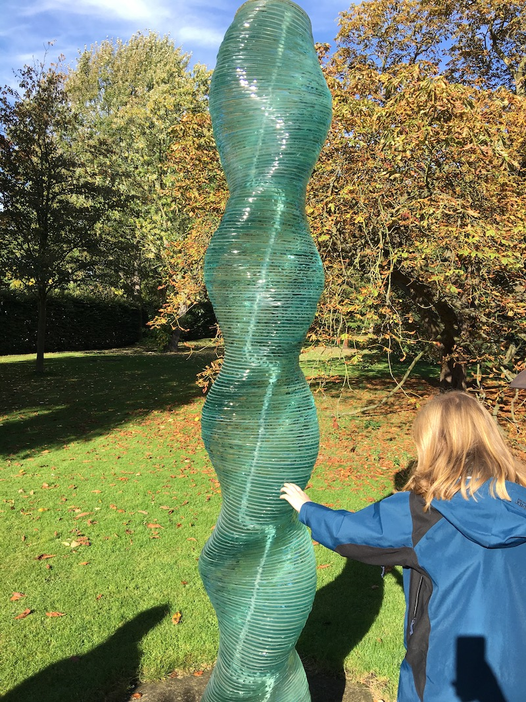

Bird Grass Kite is a blog about creativity in the age of AI.

One day while out on the sculpture trail around Cambridge, I took a photo of my future wife next to a glass sculpture.

Later that week, I experimented with a WordPress plug-in that used the Microsoft Azure platform to write alt tags for images based on their content. For the photo of my wife next to the sculpture in Cambridge, the caption it came up with was "a bird is sitting on the grass with a kite". This phrase stuck with me as it showed me how AI sees the world differently to humans.
